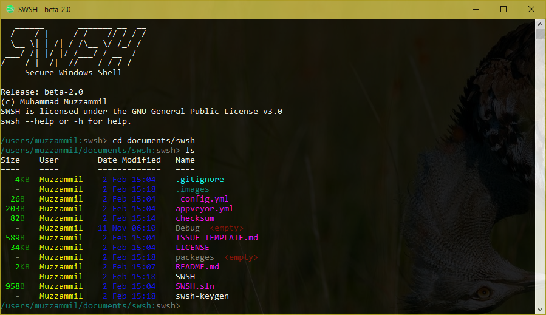

[](https://ci.appveyor.com/project/muhammadmuzzammil1998/swsh/branch/master)
  		  
SWSH is a SSH like console application for Windows.

**If you are not using a [prebuilt SWSH binary](https://github.com/SecureWindowsShell/SWSH/releases), you will see SWSH complain about a checksum mismatch and exit, use `--IgnoreChecksumMismatch` to stop it from exiting.**


*SWSH just doing its thing. Version: beta-1.4.*

# Nicknames
SSH connections are saved as **nicknames**, each should be unique.
Nicknames contains the data such as SSH private key, username and host in following structure:
```
nickname.swsh
└──C:\path\to\ssh\private.key
└──username
└──host
```
# Making a nickname with Key
To add a new nickname run ```swsh -a``` or ```swsh --add``` and fill the asked details like:
```
Path to private key: C:\path\to\ssh\private.key
Username: root
Server: my.server.ssh
Unique Nickname: server.ssh
```
# Making a nickname with Password
To add a new nickname run ```swsh -a -password``` or ```swsh --add -password``` and fill the asked details like:
```
Username: root
Server: my.server.ssh
Unique Nickname: server.ssh
```
# Connection to server
To connect, you must create add it first using ```swsh -a``` or ```swsh --add```. After that, run ```swsh -c nickname``` or ```swsh --connect nickname``` to connect.

If done properly, output would be similar to this (you will be asked for password if you didn't add key):
```
Waiting for response from usr@host...
Connected to usr@host...
~:/ $ 
```
For more, see our [documentation](DOCUMENTATION.md).

# Future
> “The best way to predict your future is to create it.” ~***Abraham Lincoln***

Feel free to contribute to this project.

Below are some things we are trying to add or fix in SWSH:

Features:
- [x] Delete nicknames ```swsh --delete```
- [x] Show all nicknames ```swsh --show```
- [x] Show details about a nickname ```swsh --show [nickname]```
- [x] File upload support ```upload```
- [x] Password support ```swsh -a -password```
- [x] Edit nicknames ```swsh --edit [nickname]```
- [x] Check existence of private key when adding a nickname
- [x] Ability to manipulate current working directory on Windows side ```cd``` ```ls```
- [x] Clear console ```clear```
- [x] Detailed help ```swsh --help [command]```
- [x] Check integrity of application
- [x] keygen for ssh ```swsh --keygen```
- [x] ```.swsh_history``` file to contain history of commands executed
- [ ] Drop SSH.NET.

Fixes:
- [x] Update README. Issue #10
- [x] ```swsh --show``` not working. Issue #8
- [x] Make ```cd ..``` work. Issue #2
- [x] A connection attempt failed while using password. Issue #1

# License
GPL v3<br>
Copyright (C) 2017  Muhammad Muzzammil & Nabeel Omer

 
